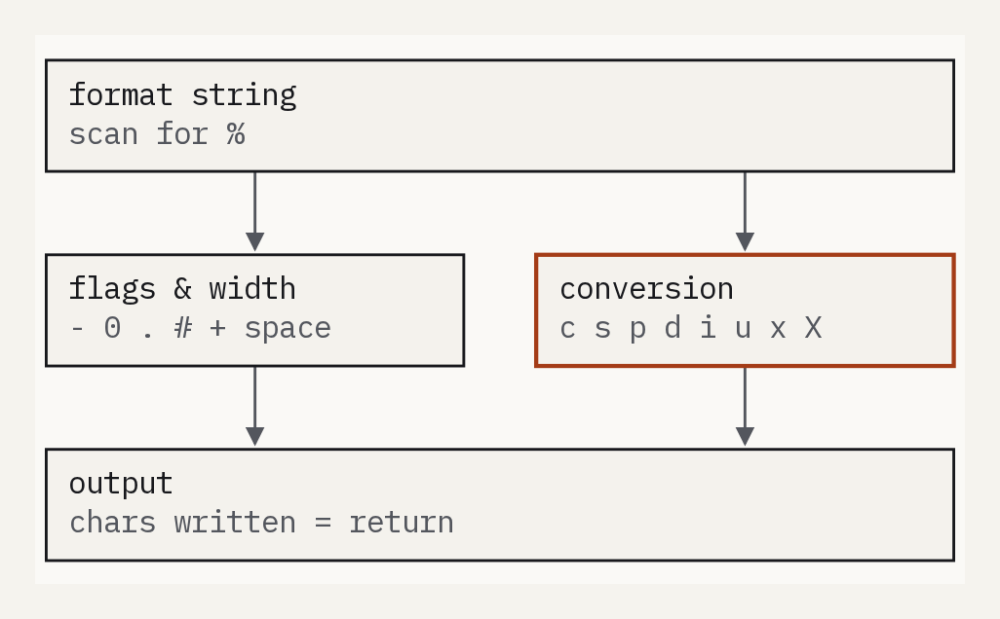
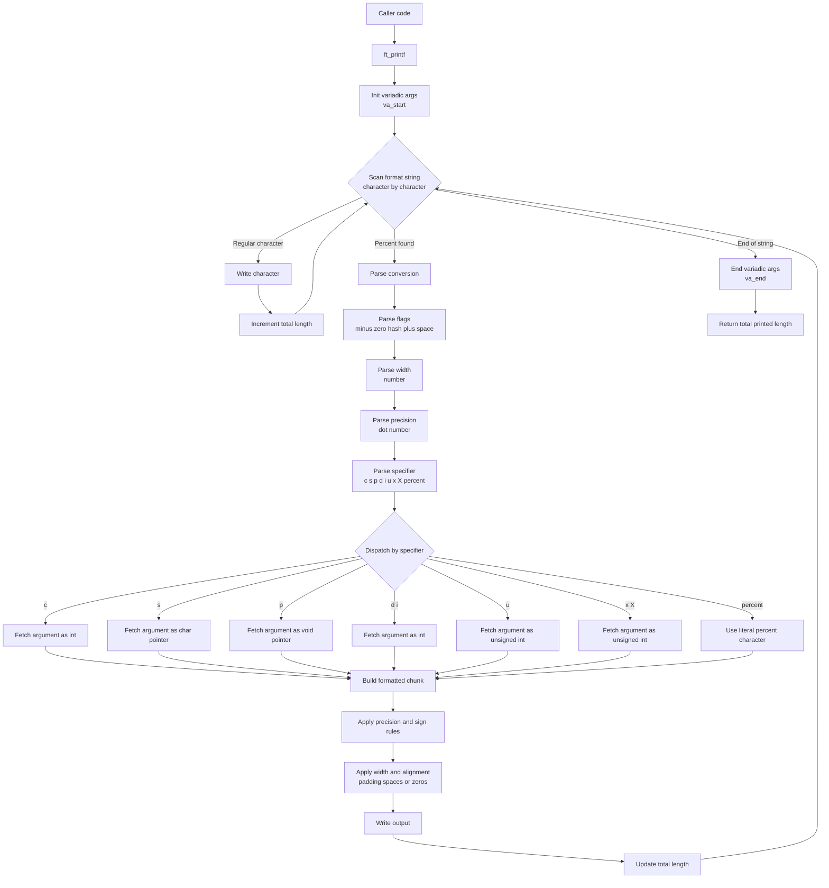

# ft_printf - Recreating printf()

  
📌 **42 School - Core Curriculum Project**  

## ▌ Description
The goal of this project is to **reimplement** the standard C `printf()` function from scratch.  
This project provided a deep dive into **variadic functions**, memory management, and formatted output handling.





## ▌ Objectives
▸ Recode a **simplified version of `printf()`**  
▸ Learn and use **variadic functions** (`va_start`, `va_arg`, `va_end`)  
▸ Implement **multiple format specifiers** (`c`, `s`, `p`, `d`, `i`, `u`, `x`, `X`, `%`)  
▸ Handle **bonus flags**: `-`, `0`, `.`, width, `#`, `+`, and space  

## ▌ Result: **122% with Bonus**
I successfully completed all mandatory parts and **bonus features**, achieving an excellent **122%** score. 🎉

## ▌ Files
- `ft_printf.h` → Contains function prototypes and required macros  
- `libftprintf.a` → Static library (generated by `make`)  
- `Makefile` → Automates compilation (`all`, `clean`, `fclean`, `re`, `bonus`)  

## ▌ Implemented Functions
### ■ **Mandatory Part**
| Specifier | Description |
|-----------|-------------|
| `%c` | Prints a single character |
| `%s` | Prints a string |
| `%p` | Prints a pointer address in hexadecimal format |
| `%d` | Prints a decimal (base 10) integer |
| `%i` | Prints an integer in base 10 |
| `%u` | Prints an unsigned decimal (base 10) integer |
| `%x` | Prints a number in lowercase hexadecimal (base 16) |
| `%X` | Prints a number in uppercase hexadecimal (base 16) |
| `%%` | Prints a percent sign `%` |

### ■ **Bonus Features**
| Feature | Description |
|---------|-------------|
| `-` | Left-align output within the field width |
| `0` | Pad numbers with leading zeros instead of spaces |
| `.` | Precision specifier for numbers and strings |
| Width | Defines a minimum field width for output |
| `#` | Adds `0x` or `0X` for hexadecimal numbers |
| `+` | Forces a plus sign (`+`) for positive numbers |
| (space) | Inserts a space before positive numbers |

## ▌ Installation & Usage
1️⃣ **Clone the repository**  
```sh
git clone https://github.com/ai-dg/ft_printf.git
cd ft_printf
```

2️⃣ Compile the library
```sh
make
```

3️⃣ Use ft_printf in another project
Include the header and link libftprintf.a:
```c
#include "ft_printf.h"

int main() {
    ft_printf("Hello, ft_printf! My number is: %d\n", 42);
    return 0;
}
```

Compile with:
```sh
gcc main.c -Wall -Wextra -Werror -L. -lftprintf -o my_program
./my_program
```

## 📜 License

This project was completed as part of the **42 School** curriculum.  
It is intended for **academic purposes only** and follows the evaluation requirements set by 42.  

Unauthorized public sharing or direct copying for **grading purposes** is discouraged.  
If you wish to use or study this code, please ensure it complies with **your school's policies**.
